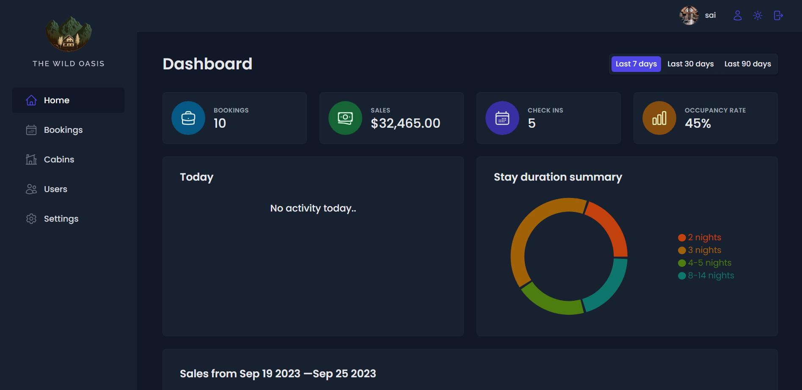
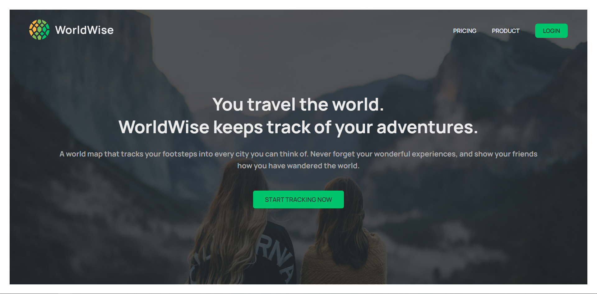
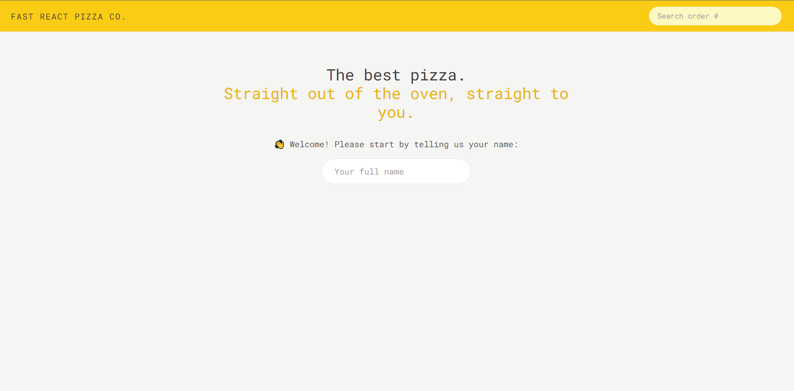
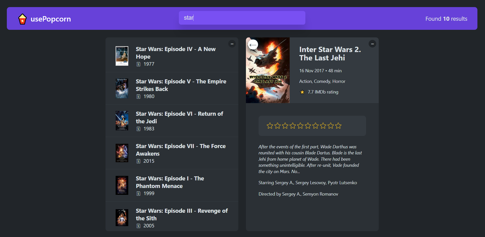

## The Wild Oasis
 "The Wild Oasis" is a hotel booking app with user authentication, allowing authorized users to manage bookings and cabin reservations.The app features data visualization through graphs and pie charts, providing users with a clear view of booking details and sales data.Its primary goal is to streamline booking management, enhance user experiences, and enable data-driven decision-making for the hotel management team.
- 
- Tags: Category 1
- Badges:
  - React [blue] 
  - Redux [blue]
  - React Query [blue]
  - Supabase [blue]
- Buttons:
  - Live Demo [https://the-wild-oasis-gray-beta.vercel.app]
  - Github [https://github.com/sairam-maurya/theWildOasis]    

## World Wise
"World Wise" lets users create notes and memories about the current location, enhancing their travel experiences.Users can select their precise location on a map, making it easy to remember and share the places they've been.
- 
- Tags: Category 2
- Badges:
  - React [blue]
  - Context Api [blue]
  - React Leaflet [blue]
- Buttons:
  - Live Demo [https://world-wise-eight.vercel.app/]
  - Github [https://github.com/sairam-maurya/worldWise]

## Fast React Pizza
"Fast React Pizza" enables users to easily order pizza online by selecting from a menu, customizing their order, and providing contact details.Users can specify their current location for accurate and timely pizza delivery.The project's primary goal is to streamline the pizza ordering process, ensuring a convenient and efficient experience for customers.
- 
- Tags: Category 3
- Badges:
  - Tailwind Css [blue]
  - React [blue]
  - Redux [blue]
- Buttons:
  - Live Demo [https://fast-react-pizza-iota.vercel.app/]
  - Github [https://github.com/sairam-maurya/fastReactPizza]

## usePopcorn
"Popcorn" allows users to rate movies according to their preferences.The project fetches movie data from an external API, ensuring a diverse and current movie selection for users to rate and engage with.
- 
- Tags: Category 3
- Badges:
  - React [blue]
  - Styled Components [blue]
- Buttons:
  - Live Demo [https://use-popcorn-sage.vercel.app/]
  - Github [https://github.com/sairam-maurya/use-popcorn] 